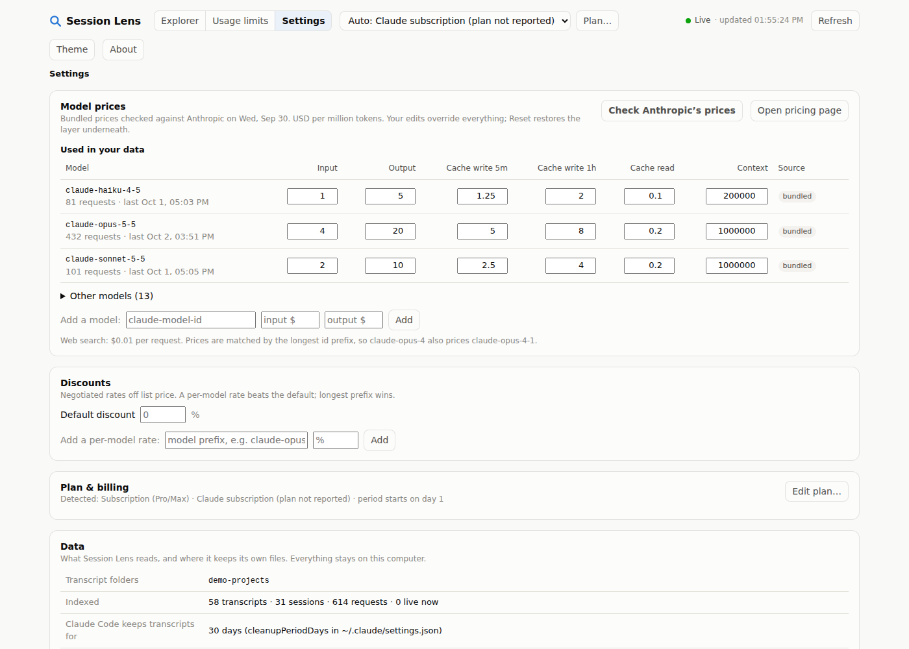

# Session Lens

See how your Claude Code usage gets spent: **day → session → prompt → request → tool call**, with live cost, what filled
the context on every call, and who made each call (your prompt, Claude iterating, subagents). It reads the transcripts
Claude Code already writes on your computer. Everything runs locally; nothing is uploaded.

| Overview | Session timeline | Prompts |
|---|---|---|
|  |  |  |
| **Request** | **Usage limits** | **Settings** |
|  |  |  |

*(Screenshots use demo data: `cd source && npm run demo`.)*

## The two folders

| Folder | For | Start here |
|---|---|---|
| [`release/`](release) | **Using it.** Ready to run, nothing to build. | Double-click `release/session-lens/Start Session Lens.cmd` (needs Node.js 20+), or install `release/session-lens.vsix` in VS Code. See [release/README.md](release/README.md). |
| [`source/`](source) | **Changing it.** Code, tests, and the build that produces `release/`. | [source/README.md](source/README.md): `cd source`, `npm install`, `npm run build`, `npm test`, `npm run release`. |

## What it's for, and its limits

Session Lens is best for **relative** questions: which sessions, prompts, requests and tool calls filled the context and drove the cost. Its dollar figures are close estimates at list price. For what you are billed, Claude's own usage page is the source of truth. The app shows the same explanation on first launch, and under **About**.

It only sees what reached this computer's transcripts, so expect it to read somewhat lower than the dashboard. Common reasons:

- **Usage elsewhere:** Claude Code on the web or in the cloud, sessions started from your phone, other computers, and Chat, Cowork or Claude in Chrome.
- **Calls with no record:** a request billed after the connection dropped, and small internal calls. Where Claude Code writes its own running total, each run is compared with it and the difference is added.
- **Deleted or expired transcripts:** sessions you deleted, and anything older than `cleanupPeriodDays`.
- **Your organisation's rates:** set discounts or prices in Settings.
- **Late adjustments:** Anthropic can revise a day's figures for up to 30 days.

To check one month against the dashboard, enter its daily figures under **Usage limits**. You can paste rows straight from a spreadsheet. Session Lens then shows the gap day by day and flags the few days that hold most of it.

**Prices go stale.** The price table ships with the build, and Anthropic adds models and changes prices often. When that happens, run **Settings → Check Anthropic's prices**, or edit prices by hand. A model with no price shows "—" rather than a guess.

## License

MIT. See [LICENSE](LICENSE).
