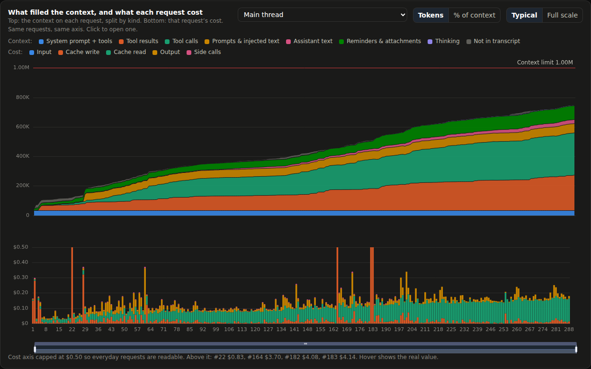
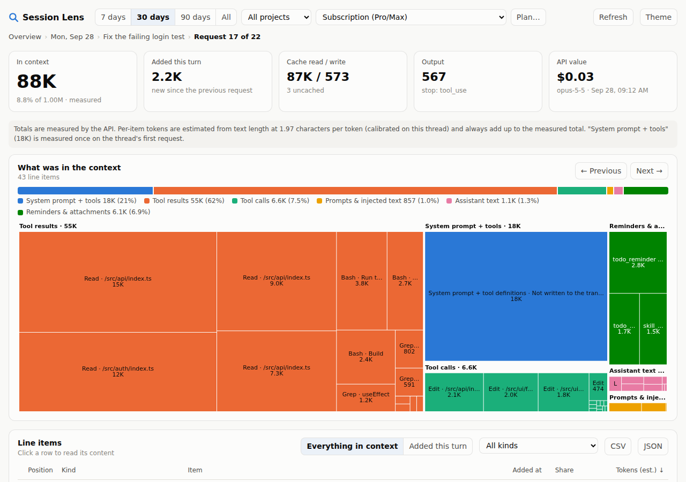
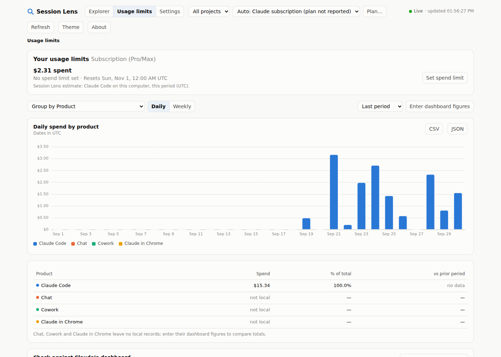

# Session Lens

Claude's usage report shows spend per day. Session Lens starts at the same daily view and lets you click down four levels:

**Day → Session → Request → what was in the context**

At the bottom level you see every line item the model was carrying on that call: the system prompt, each file read, each tool result, each reminder. Items are sized in tokens, flagged when they were new that turn, and clickable to read the raw content.

It reads the transcripts Claude Code already writes to `~/.claude/projects`. Everything runs locally, and nothing is uploaded.

## Run it

```sh
git clone https://github.com/pman13a/session-lens.git
cd session-lens
npm install
npm run build
npm start               # opens http://127.0.0.1:4317
```

- `npm run demo`: generates two weeks of synthetic transcripts and opens the dashboard on them.
- `node apps/server/dist/cli.js --projects <dir>[,<dir>] --port <n> --no-open`
- **VS Code:** `npm run package:vscode`, then *Extensions → … → Install from VSIX* and pick `apps/vscode/session-lens.vsix`. Run **Session Lens: Open**, or use the **Session Lens** tab in the bottom panel next to Terminal. Drag either one to the secondary sidebar to keep it on the far right. The status bar shows today's spend.
- **Desktop window:** `npm run desktop` (Electron; installed separately so the CLI never downloads it). It talks to its window over IPC and opens no network port.

## Live updates

Every view updates while Claude Code works, usually within half a second of a transcript being written. The header shows **● Live · updated hh:mm:ss**.

- **What it follows:** transcripts, Claude Code's live-session registry (`<configDir>/sessions/<pid>.json`), and the shared settings file. It uses `fs.watch` with a 2 s stat poll as backup, because `fs.watch` drops events on macOS and on network filesystems.
- **Reading cost:** only the bytes appended since the last read, in 2 MB windows, so a 100 MB transcript is never loaded whole. A half-written line, or a character split across two writes, waits for the rest.
- **How views get the news:**
  - browser: server-sent events;
  - VS Code: the extension messages its panels;
  - desktop app: an IPC event.
- **Redraws:** in place, at most every 1.5 s. Your scroll position, table sort, expanded prompts, filters and any open drawer are kept. Nothing redraws while the page is hidden; it catches up when you return.
- **Live now:** a card lists running sessions with their current context and cost.
- **VS Code status bar:** follows the session you're working in (`42% ctx · $1.23 · $17.65 today`).
- **Shared settings:** a change made in one shell (browser, VS Code, desktop) reaches the others straight away. Writes are atomic: temp file, then rename.

## The four levels

| Overview | Session | Request |
|---|---|---|
|  |  |  |

*(Screenshots use `npm run demo` data.)*

| Level | Shows | Click |
|---|---|---|
| Overview | Cost or tokens per day, stacked by input / cache write / cache read / output. **Spend accumulated** over the range, with your monthly limit or plan fee as a reference line and the current pace carried to the end of the billing period. Totals, sessions in range, CSV/JSON export | a day |
| Day | That day's sessions: context-growth sparkline, peak context %, tokens, cost | a session |
| Session | **What filled the context over time** (stacked by kind, in tokens or % of context, per thread), **cost accumulated over the session** (running total by component, by request or by clock time; the steps show where a cold cache was rewritten), context size per request against the limit, cost per request split by component, each prompt with the requests that answered it, subagents | a request |
| Request | Measured totals, a composition bar, a treemap and ranked table of every context line item, "added this turn" filter, prev/next, and the response's own blocks | an item, to read its raw text |

## How the numbers are made

- **Totals are measured.** Every request's `usage` block (input, cache read, cache write 5m/1h, output, thinking, web searches) comes straight from the transcript.
- **Cost** = those tokens × `config/pricing.json`. Cache prices are listed per model, not derived: cache reads are 0.1× input on most models, but 0.05× on Opus 5.5 and 0.025× on Fable 5.1. Estimates are at API list prices; subscription plans bill differently.
- **Side calls are reconciled.** Claude Code writes its own running total (`cost-state`) into the transcript. That total includes calls never written as records: title generation, safety checks, fetch summaries. At the last checkpoint, the gap between Claude Code's total and the records is spread over the requests before it, so session and day totals match Claude Code. Measured: transcript $34.60 + side calls $0.97 = Claude Code's $35.57. It shows as **Side calls** in the daily cost chart and on the session tile.
- **Unknown models are never guessed.** Their tokens count, their dollars show as "—", and the overview says how many requests are unpriced. Add a price under `prices` in settings.
- **Deleted history is flagged.** Claude Code deletes transcripts older than `cleanupPeriodDays` (30 by default). A range or prior period that reaches back past that reads "no data", not $0 or −100%.
- **Per-item tokens are estimates** that always add up to the measured total:
  - *System prompt + tools* never appear in the transcript. They are measured **once**, on a thread's first request, as measured input minus visible content.
  - Visible items are sized by text length at a **calibrated** chars-per-token rate: the median of Δchars/Δtokens between consecutive requests on that thread, about 2.2 on current models. A fixed chars/4 would under-count by nearly half.
  - What the transcript can't explain is shown as **Not in transcript**, pinned to the step where it appeared. The usual cause is tool schemas that ToolSearch or MCP loaded mid-session. Spreading it over every item would hide where it came from.

### Transcript quirks handled (each has a test)

- One API response is written as several records (one per content block) that share one `requestId` and one `usage`. It is counted once.
- Forked or resumed sessions copy the parent's history into a new file. Request IDs are deduplicated **across all files**, and the oldest file owns them.
- `<synthetic>` records are not API calls.
- Subagent transcripts live in `<session>/subagents/agent-*.jsonl` with a `.meta.json`. They stay on their own thread (never merged into the parent's context) and are grouped under the prompt whose tool call launched them.
- Current models have a 1M context window (Haiku 4.5 has 200K). Nothing assumes 200K.

## Usage limits: check it against Claude's own page

The **Usage limits** tab mirrors the Enterprise/Team usage page in claude.ai (Settings → Usage) so the two can be compared number for number:

- The same header ("$X of $Y spent", spend limit, reset time, % used), the same **Group by** (Product, plus Model, Project and Surface), **Daily / Weekly**, and the same date range, defaulting to the current period.
- The same conventions: **dates in UTC**, the period resets at 00:00 UTC, and "vs prior period" compares with the same number of days just before.
- The same **Product · Spend · % of total · vs prior period** table and **Top skills** (through yesterday, UTC).

**Enter dashboard figures** stores the dashboard's own numbers in `~/.session-lens/reference.json`, on this computer only:
- the header total and limit,
- the product table for the selected range,
- optionally each day's Claude Code value, pasted in any common format.

The page then shows them side by side and splits the gap into signed terms: days with no local usage, days reading lower, and days reading higher. A reading higher than the dashboard is a red flag for double counting. A steady ratio across days points to a rate difference, which a discount under **Plan…** fixes. A varying ratio points to usage from the cloud or another computer.

Chat, Cowork and Claude in Chrome leave no local records, so for those rows the dashboard is the only source.



## Plan-aware cost

Session Lens asks Claude Code which account is logged in (`claude auth status --json`, which never exposes credentials) and labels cost to match:

| Account | Headline | Billing period card |
|---|---|---|
| API key, Bedrock, Vertex | **Spend** at API prices | Spend against your monthly budget, if you set one |
| Pro / Max | **API-equivalent value**: what the usage would cost on the API | Value so far against your plan fee |
| Team / Enterprise | **Usage at API rates** | Spend against the monthly allowance |

The Max 5× / 20× tier is read from `~/.claude.json` (`organizationType` and rate-limit tier only, never the email or account IDs), so the plan fee fills itself in: Pro $20, Max 5× $100, Max 20× $200.

The **Billing** menu in the header overrides the detected mode, and **Plan…** sets the plan price, monthly limit, period start day and discount. Changes are saved to `~/.session-lens/settings.json` and shared by the browser, VS Code and desktop versions.

Pro and Max limits are 5-hour and weekly usage windows. Transcripts don't record the percentage used; only claude.ai → Settings → Usage shows it.

## What it covers

It covers Claude Code sessions that ran **on this computer**: the terminal, VS Code, JetBrains, the desktop app's Code tab, and Remote Control sessions hosted here. It does not see:

- Claude Code on the web or cloud sessions started from the phone app, which run in Anthropic's cloud, so their transcripts never reach this machine.
- Other computers, unless you copy or sync their `~/.claude/projects` and pass every folder with `--projects a,b`. Duplicates are removed automatically.
- claude.ai chat, the desktop or mobile chat apps, and Cowork. On Pro/Max these draw on the same limits but leave no local transcripts.
- Small internal calls that Claude Code bills but doesn't write as records. These are reconciled from Claude Code's own `cost-state` total up to its last checkpoint; calls after that checkpoint are missing until Claude Code writes the next one.

## Settings

`~/.session-lens/settings.json` (optional):

```json
{
  "billing": "subscription",
  "planPrice": 200,
  "monthlyLimit": 500,
  "periodStartDay": 1,
  "discount": 0.1,
  "modelDiscounts": { "claude-opus": 0.2 },
  "timeZone": "America/Chicago",
  "prices": { "claude-opus-5-5": { "input": 4, "output": 20 } }
}
```

## Layout

```
packages/core   parse, dedupe, price, aggregate, context attribution, JSON API, HTTP server
packages/ui     the dashboard (Vite + ECharts), one bundle for every shell
apps/server     `session-lens` CLI
apps/vscode     editor tab + bottom-panel view + status bar, bridged over postMessage
apps/desktop    Electron window
scripts/        demo-data generator
```

`npm test` runs the core tests.

## License

MIT. See [LICENSE](LICENSE).
