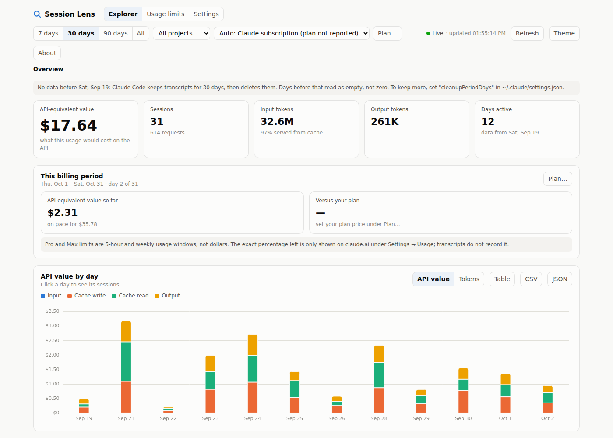
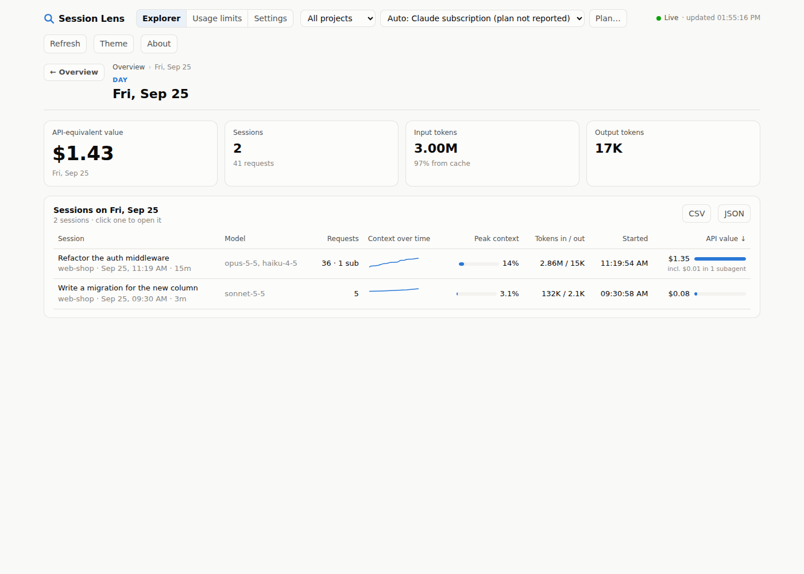
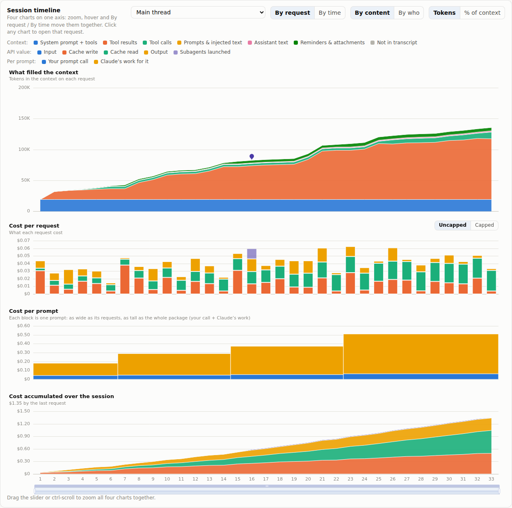
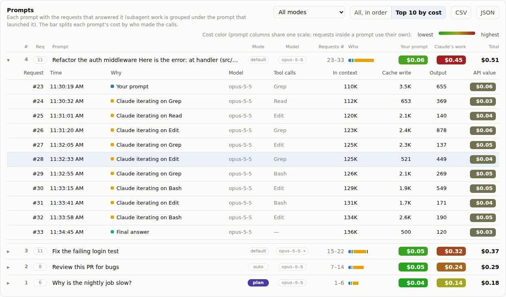
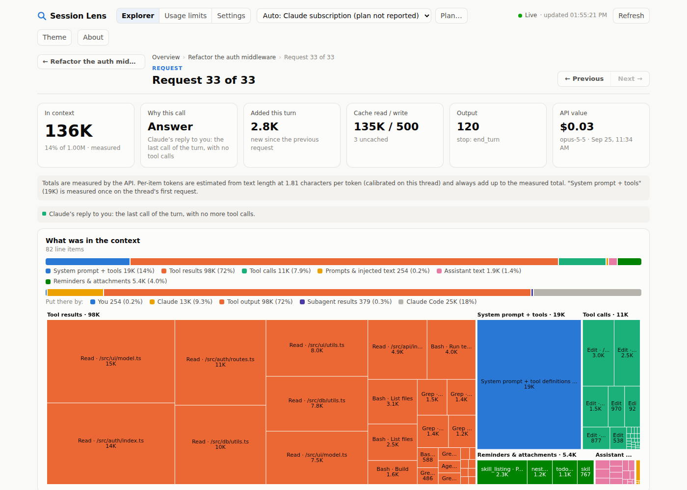
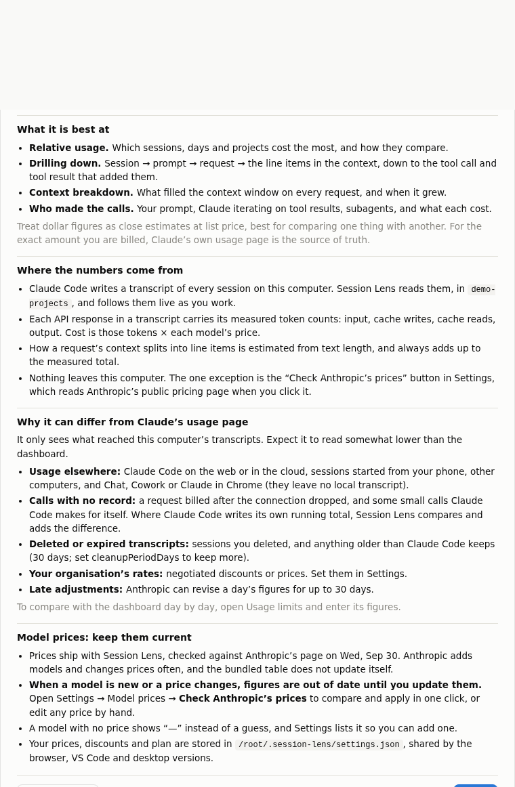

# Session Lens: source

This folder builds everything in [`../release`](../release). To just run Session Lens, go there instead.

Claude's usage report shows spend per day. Session Lens starts at the same daily view and lets you click down:

**Day → Session → Prompt → Request → what was in the context**

At the bottom level you see every line item the model was carrying on that call: the system prompt, each file read, each tool result, each reminder. Items are sized in tokens, flagged when they were new that turn, and clickable to read the raw content.

It reads the transcripts Claude Code already writes to `~/.claude/projects`. Everything runs locally, and nothing is uploaded.

## Build and run

```sh
git clone https://github.com/pman13a/session-lens.git
cd session-lens/session-lens/source
npm install
npm run build
npm start               # opens http://127.0.0.1:4317
```

- `npm run release`: builds `../release/` (the ready-to-run folder, the portable zip and the `.vsix`). Commit the result to publish it.
- `npm run demo`: generates two weeks of synthetic transcripts and opens the dashboard on them.
- `node apps/server/dist/cli.js --projects <dir>[,<dir>] --port <n> --no-open`
- **VS Code:** `npm run package:vscode`, then *Extensions → … → Install from VSIX* and pick `apps/vscode/session-lens.vsix`. Run **Session Lens: Open**, or use the **Session Lens** tab in the bottom panel next to Terminal. Drag either one to the secondary sidebar to keep it on the far right. The status bar shows today's spend.
- **Desktop window:** `npm run desktop` (Electron; installed separately so the CLI never downloads it). It talks to its window over IPC and opens no network port.

## Live updates

Every view updates while Claude Code works, usually within half a second of a transcript being written. The header shows **● Live · updated hh:mm:ss**.

- **What it follows:** transcripts, Claude Code's live-session registry (`<configDir>/sessions/<pid>.json`), and the shared settings file. It uses `fs.watch` with a 2 s stat poll as backup, because `fs.watch` drops events on macOS and on network filesystems.
- **Reading cost:** only the bytes appended since the last read, in 2 MB windows, so a 100 MB transcript is never loaded whole. A half-written line, or a character split across two writes, waits for the rest.
- **How views get the news:**
  - browser: server-sent events;
  - VS Code: the extension messages its panels;
  - desktop app: an IPC event.
- **Redraws:** in place, at most every 1.5 s. Your scroll position, table sort, expanded prompts, filters and any open drawer are kept. Nothing redraws while the page is hidden; it catches up when you return.
- **Live now:** a card lists running sessions with their current context and cost.
- **VS Code status bar:** follows the session you're working in (`42% ctx · $1.23 · $17.65 today`).
- **Shared settings:** a change made in one shell (browser, VS Code, desktop) reaches the others straight away. Writes are atomic: temp file, then rename.

## The levels

| Overview | Day | Session |
|---|---|---|
|  |  |  |
| **Prompts** | **Request** | **About** |
|  |  |  |

*(Screenshots use `npm run demo` data.)*

| Level | Shows | Click |
|---|---|---|
| Overview | Cost or tokens per day, stacked by input, cache write, cache read and output. **Spend accumulated** over the range against your monthly limit or plan fee, with the pace to the end of the billing period. **Who made the calls** (your prompts, Claude iterating, subagents). Live sessions, sessions in range, CSV/JSON export | a day |
| Day | That day's sessions: context-growth sparkline, peak context %, tokens, cost (with subagent share) | a session |
| Session | A page header with Back. **Session timeline**: four charts on one axis, one zoom and one crosshair: what filled the context (by content or by who), cost per request (uncapped or capped), **cost per prompt** (one block per prompt, split into your call and Claude's work) and cost accumulated; *By request* or *By time*. **Prompts**: one row per prompt with request count, mode (plan highlighted), model, the timeline request range, and **your prompt vs Claude's work** heat-mapped on one scale, plus a Top 10 toggle, a mode filter and the full prompt on hover. Expand a prompt for its requests, numbered as on the timeline and heat-mapped within the prompt. Then subagents and who launched them | a request |
| Request | Why this call happened, measured totals, the context split by kind and by who put it there, a treemap and table of every line item, "added this turn", the response's own blocks. Previous/Next buttons and the ← → keys | an item, to read its raw text |

## Your calls vs Claude's own

One prompt from you usually turns into many API calls. Session Lens labels each call by why it happened. It does this by walking back from the call to the transcript record that caused it.

| Role | What it means | How it's told |
|---|---|---|
| **Your prompt** | The call your message started | The call follows a message Claude Code tagged `origin: human` |
| **Claude iterating** | Claude calling the model again, on its own, to act on tool results | The call follows tool results; the tools are named ("iterating on Bash, Read") |
| **Final answer** | Claude's reply to you | An iteration that calls no tools: nothing is left to iterate on |
| **Subagent** | Work inside a subagent Claude launched | The call is in `subagents/agent-*.jsonl`, linked to the request whose Agent/Task call launched it |
| **Automatic** | Claude Code started it itself | A background task finishing (`task-notification`), compaction |

Where it shows:

- **Overview and session:** a "Who made the calls" split of cost and requests.
- **Timeline:** a **By who** toggle. The context panel is split by who put each token there (you, Claude, tool output, subagent results, Claude Code). The cost bars are colored by role. Each subagent's whole cost sits on top of the request that launched it, with a pin marking the launch.
- **Prompts list:** each prompt has a small split bar, and each request has a **Why** column.
- **Request page:** a **Why this call** tile and a sentence linking to the subagents it launched, or to the request that launched it.
- **Line items:** a **Who** column and filter.
- **Sessions table:** "incl. $X in N subagents".
- **Usage limits:** **Group by Who**.

## What it's for, and its limits

Session Lens is best for **relative** questions: which sessions, prompts, requests and tool calls filled the context and drove the cost. Its dollar figures are close estimates at list price. For what you are billed, Claude's own usage page is the source of truth. The app shows the same explanation on first launch, and under **About**.

It only sees what reached this computer's transcripts, so expect it to read somewhat lower than the dashboard. Common reasons:

- **Usage elsewhere:** Claude Code on the web or in the cloud, sessions started from your phone, other computers, and Chat, Cowork or Claude in Chrome.
- **Calls with no record:** a request billed after the connection dropped, and small internal calls. Where Claude Code writes its own running total, each run is compared with it and the difference is added.
- **Deleted or expired transcripts:** sessions you deleted, and anything older than `cleanupPeriodDays`.
- **Your organisation's rates:** set discounts or prices in Settings.
- **Late adjustments:** Anthropic can revise a day's figures for up to 30 days.

To check one month against the dashboard, enter its daily figures under **Usage limits**. You can paste rows straight from a spreadsheet. Session Lens then shows the gap day by day and flags the few days that hold most of it.

**Prices go stale.** The price table ships with the build, and Anthropic adds models and changes prices often. When that happens, run **Settings → Check Anthropic's prices**, or edit prices by hand. A model with no price shows "—" rather than a guess.

## How the numbers are made

- **Totals are measured.** Every request's `usage` block (input, cache read, cache write 5m/1h, output, thinking, web searches) comes straight from the transcript.
- **Cost** = those tokens × `config/pricing.json`. Cache prices are listed per model, not derived: cache reads are 0.1× input on most models, but 0.05× on Opus 5.5 and 0.025× on Fable 5.1. Estimates are at API list prices; subscription plans bill differently.
- **Side calls are reconciled.** Claude Code writes its own running total (`cost-state`) into the transcript. That total includes calls never written as records: title generation, safety checks, fetch summaries. At the last checkpoint, the gap between Claude Code's total and the records is spread over the requests before it, so session and day totals match Claude Code. Measured: transcript $34.60 + side calls $0.97 = Claude Code's $35.57. It shows as **Side calls** in the daily cost chart and on the session tile.
- **Unknown models are never guessed.** Their tokens count, their dollars show as "—", and the overview says how many requests are unpriced. Add a price under `prices` in settings.
- **Deleted history is flagged.** Claude Code deletes transcripts older than `cleanupPeriodDays` (30 by default). A range or prior period that reaches back past that reads "no data", not $0 or −100%.
- **Per-item tokens are estimates** that always add up to the measured total:
  - *System prompt + tools* never appear in the transcript. They are measured **once**, on a thread's first request, as measured input minus visible content.
  - Visible items are sized by text length at a **calibrated** chars-per-token rate: the median of Δchars/Δtokens between consecutive requests on that thread, about 2.2 on current models. A fixed chars/4 would under-count by nearly half.
  - What the transcript can't explain is shown as **Not in transcript**, pinned to the step where it appeared. The usual cause is tool schemas that ToolSearch or MCP loaded mid-session. Spreading it over every item would hide where it came from.

### Transcript quirks handled (each has a test)

- One API response is written as several records (one per content block) that share one `requestId` and one `usage`. It is counted once.
- Forked or resumed sessions copy the parent's history into a new file. Request IDs are deduplicated **across all files**, and the oldest file owns them.
- `<synthetic>` records are not API calls.
- Subagent transcripts live in `<session>/subagents/agent-*.jsonl` with a `.meta.json`. They stay on their own thread (never merged into the parent's context) and are grouped under the prompt whose tool call launched them.
- Current models have a 1M context window (Haiku 4.5 has 200K). Nothing assumes 200K.

## Usage limits: check it against Claude's own page

The **Usage limits** tab mirrors the Enterprise/Team usage page in claude.ai (Settings → Usage) so the two can be compared number for number:

- The same header ("$X of $Y spent", spend limit, reset time, % used), the same **Group by** (Product, plus Model, Project and Surface), **Daily / Weekly**, and the same date range, defaulting to the current period.
- The same conventions: **dates in UTC**, the period resets at 00:00 UTC, and "vs prior period" compares with the same number of days just before.
- The same **Product · Spend · % of total · vs prior period** table and **Top skills** (through yesterday, UTC).

**Enter dashboard figures** stores the dashboard's own numbers in `~/.session-lens/reference.json`, on this computer only:
- the header total and limit,
- the product table for the selected range,
- optionally each day's Claude Code value, pasted in any common format.

The page then shows them side by side and splits the gap into signed terms: days with no local usage, days reading lower, and days reading higher. A reading higher than the dashboard is a red flag for double counting. A steady ratio across days points to a rate difference, which a discount under **Plan…** fixes. A varying ratio points to usage from the cloud or another computer.

Chat, Cowork and Claude in Chrome leave no local records, so for those rows the dashboard is the only source.


## Plan-aware cost

Session Lens asks Claude Code which account is logged in (`claude auth status --json`, which never exposes credentials) and labels cost to match:

| Account | Headline | Billing period card |
|---|---|---|
| API key, Bedrock, Vertex | **Spend** at API prices | Spend against your monthly budget, if you set one |
| Pro / Max | **API-equivalent value**: what the usage would cost on the API | Value so far against your plan fee |
| Team / Enterprise | **Usage at API rates** | Spend against the monthly allowance |

The Max 5× / 20× tier is read from `~/.claude.json` (`organizationType` and rate-limit tier only, never the email or account IDs), so the plan fee fills itself in: Pro $20, Max 5× $100, Max 20× $200.

The **Billing** menu in the header overrides the detected mode, and **Plan…** sets the plan price, monthly limit, period start day and discount. Changes are saved to `~/.session-lens/settings.json` and shared by the browser, VS Code and desktop versions.

Pro and Max limits are 5-hour and weekly usage windows. Transcripts don't record the percentage used; only claude.ai → Settings → Usage shows it.

## What it covers

It covers Claude Code sessions that ran **on this computer**: the terminal, VS Code, JetBrains, the desktop app's Code tab, and Remote Control sessions hosted here. It does not see:

- Claude Code on the web or cloud sessions started from the phone app, which run in Anthropic's cloud, so their transcripts never reach this machine.
- Other computers, unless you copy or sync their `~/.claude/projects` and pass every folder with `--projects a,b`. Duplicates are removed automatically.
- claude.ai chat, the desktop or mobile chat apps, and Cowork. On Pro/Max these draw on the same limits but leave no local transcripts.
- Small internal calls that Claude Code bills but doesn't write as records. These are reconciled from Claude Code's own `cost-state` total up to its last checkpoint; calls after that checkpoint are missing until Claude Code writes the next one.

## Settings

The **Settings** tab covers everything below, so you rarely need to edit the file by hand.

- **Model prices.** Every model, with its input, output, 5-minute and 1-hour cache write, cache read, and context prices, and where each price came from: *bundled*, *from Anthropic*, or *your edit*. The models your transcripts use are listed first, with request counts. Edit any cell inline; **Reset** removes your edit. Models with no price are listed so you can add one, and cache prices default to the standard multipliers (1.25×, 2×, 0.1×).
- **Check Anthropic's prices.** One GET request to the public [pricing page](https://platform.claude.com/docs/en/about-claude/pricing) (its Markdown version). It lists new models and changed prices next to yours, and you can apply them one at a time or all at once. Applied prices form their own layer, so a later bundled update never silently overrides them. This is the only network request Session Lens makes, and it only happens when you click the button.
- **Discounts.** A default rate, plus rates per model prefix.
- **Plan & billing.** Opens the same editor as the **Plan…** button.
- **Data.** Which transcript folders are read, how many transcripts are indexed, Claude Code's retention period, the time zone days are counted in, and where settings are stored.

`~/.session-lens/settings.json` (optional):

```json
{
  "billing": "subscription",
  "planPrice": 200,
  "monthlyLimit": 500,
  "periodStartDay": 1,
  "discount": 0.1,
  "modelDiscounts": { "claude-opus": 0.2 },
  "timeZone": "America/Chicago",
  "prices": { "claude-opus-5-5": { "input": 4, "output": 20 } }
}
```

## Layout

```
../release/     the shareable build (committed): npm run release writes it
../docs/        screenshots
packages/core   parse, dedupe, price, aggregate, context attribution, roles, JSON API, HTTP server
packages/ui     the dashboard (Vite + ECharts), one bundle for every shell
apps/server     `session-lens` CLI (bundled into ../release/session-lens/session-lens.mjs)
apps/vscode     editor tab + bottom-panel view + status bar, bridged over postMessage
apps/desktop    Electron window
config/         pricing.json: the bundled price table
scripts/        demo-data generator, release builder
```

`npm test` runs the core tests.

## License

MIT. See [LICENSE](../LICENSE).
